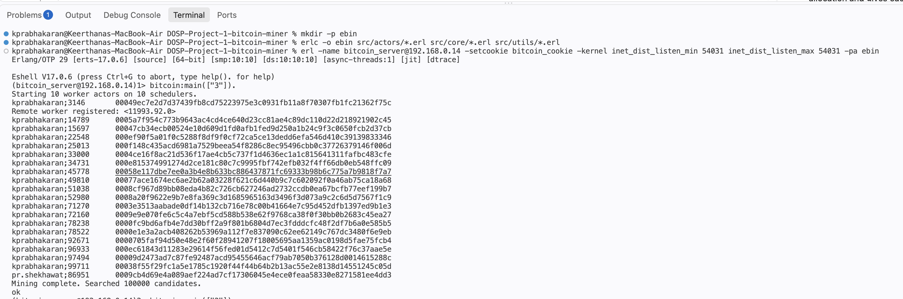
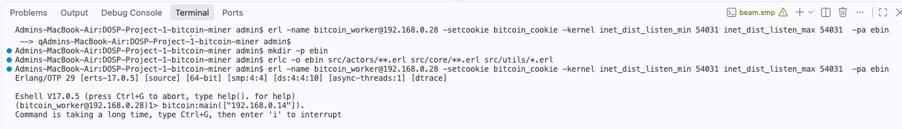

# COP5615 Project 1 - Bitcoin Miner

This project is implemented in Erlang and uses the Actor Model for parallel and distributed computation.

## Group members:
Pradhyuman Singh Shekhawat, UFID: 55742970, Email: [pr.shekhawat@ufl.edu](mailto\:pr.shekhawat@ufl.edu)
Keerthana Prabhakaran,  UFID: 20255736 , Email: [kprabhakaran@ufl.edu](mailto\:kprabhakaran@ufl.edu)

## Project Overview
The program searches for strings whose SHA-256 hash starts with a specified number of zeroes.
The mining work is divided into ranges and processed by worker actors under the control of a boss actor.
The implementation is designed to make use of multiple CPU cores and to support distributed workers running on other machines.

## Current Implementation
The project currently includes:
- SHA-256 hashing using Erlang's `crypto` module
- Verification of hashes with a required number of leading zeroes
- Candidate generation using a GatorLink ID and nonce
- Worker actors for processing ranges of candidate values
- A boss actor that assigns work to workers
- Dynamic assignment of new work when a worker finishes its current range
- Multiple worker actors running concurrently
- Use of the available Erlang schedulers for local parallel execution
- Command-line entry point for starting the miner

## Project Structure
```text
DOSP-Project-1-bitcoin-miner/
├── src/
│   ├── actors/
│   │   ├── bitcoin_boss.erl
│   │   └── bitcoin_worker.erl
│   ├── core/
│   │   ├── bitcoin.erl
│   │   └── bitcoin_miner.erl
│   └── utils/
│       └── bitcoin_utils.erl
├── test/
│   └── bitcoin_tests.erl
├── README.md
└── .gitignore
```

### Source Files
|Filename|Description|
|---|---|
|src/core/bitcoin.erl| Command-line entry point for the program.|
src/actors/bitcoin_boss.erl| Coordinates the mining process. It creates worker actors, assigns ranges of work receives completed results, and assigns additional work to available workers.
|src/actors/bitcoin_worker.erl|Worker actor responsible for receiving a range of candidate values, mining that range, and returning any valid coins to the boss.|
|src/core/bitcoin_miner.erl| Performs the actual mining operation over an assigned range.|
|src/utils/bitcoin_utils.erl| Contains candidate generation, SHA-256 hash conversion, and leading-zero helpers.|

## Steps to Execute
Compile the source files and test:
```bash
mkdir -p ebin
erlc -o ebin src/actors/**.erl src/core/**.erl src/utils/*.erl test/**.erl
```

Run the unit tests:
```bash
erl -noshell -pa ebin -eval 'eunit:test(bitcoin_tests, [verbose]), halt().'
```

Start Erlang with the compiled modules:
```bash
erl -name bitcoin_server@192.168.0.14 -setcookie bitcoin_cookie -kernel inet_dist_listen_min 54031 inet_dist_listen_max 54031 -pa ebin
```

The current local entry point accepts the required number of leading zeroes:
```erlang
bitcoin:main(["4"]).
```

For example, 4 searches for hashes beginning with:
```text
0000
```

The program prints each valid coin found by the server in the following format:
```text
input;nonce SHA-256-hash
```

## 
### Example 1
The project specification requires:
```text
pr.shekhawat;kjsdfk11
```
to produce:
```text
0d402337f95d018438aad6c7dd75ad6e9239d6060444a7a6b26299b261aa9a8b
```

## Actor Model
The mining work is divided among worker actors.
The boss actor maintains the work allocation and gives each worker a range of candidate values.
When a worker finishes, it sends the results back to the boss and receives another range when more work is available.
This allows multiple workers to operate concurrently while keeping work allocation centralized in the boss.

## Distributed Mining
A server will allow the remote worker running on another machine to connect and receive mining work.
The intended usage is:

**Server:**
```text
bitcoin <number_of_zeroes>
```

**Worker:**
```text
bitcoin <server_ip>
```


## Output



## Performance

A work unit is the number of candidate sub-problems assigned to a worker in a
single request from the boss.

Different work-unit sizes were benchmarked using `k = 4` and a total search space
of one million candidates.

The benchmark results were:

| Work unit | Real time | User time | System time | CPU time | CPU/REAL |
|---:|---:|---:|---:|---:|---:|
| 1,000 | 1.14 s | 6.56 s | 0.24 s | 6.80 s | 5.965 |
| 5,000 | 1.10 s | 6.54 s | 0.28 s | 6.82 s | 6.200 |
| 10,000 | 1.10 s | 6.52 s | 0.29 s | 6.81 s | 6.191 |
| 50,000 | 1.24 s | 6.41 s | 0.27 s | 6.68 s | 5.387 |
| 100,000 | 1.50 s | 6.22 s | 0.25 s | 6.47 s | 4.313 |

The `5,000` work-unit size was selected from this benchmark because it achieved
the lowest measured real time, tied with `10,000`, while also producing the
highest CPU/REAL ratio in the measured runs.

The final implementation uses a work unit of:

```text
10,000 candidates
```

The difference between 5,000 and 10,000 was small in this benchmark, so the
final implementation retained 10,000 as the configured value.

Performance varies with hardware and system load.

## Final k = 4 Results

The final local execution used:

```text
k = 4
Total candidates = 1,000,000
Worker actors = 8
Schedulers = 8
```

The final run found:

```text
Coins found: 9

Real time: 1.19 seconds
User time: 6.50 seconds
System time: 0.23 seconds
CPU time: 6.730 seconds
CPU/REAL ratio: 5.655
```

The nine valid coins found were:

```text
pr.shekhawat;384638     0000261c062882e7487951b7b6efbfba36f727328a4eb325e855c67c24e28ad9
pr.shekhawat;531213     00004b62d9c40c384759777dfb56a4054bafdfbbd5b372ebd5a5c74b84b4e957
pr.shekhawat;548978     00003e2d5da3f6b8928946a42cefca9dfbcf629d1a58bc1ce27f757307b35f4b
pr.shekhawat;549988     00003775d931492340880ea1850c8f696c779a9bc09d9c1c8ac915bf0f42fad3
pr.shekhawat;569273     00005b1e8bf568f6627f83845289b73c0952c5285a8eff4c38c37b68d7af538b
pr.shekhawat;758163     000057e301107c11b3fa09c44bba7785685375fe61c99858c0db19bad7deacff
pr.shekhawat;844952     0000eab08bcb26bbdad7c7f4364d02cc4e8ad7eb2c8aa08af3b93e5e4f2487b3
pr.shekhawat;895091     00007e70e7208dd692ab45fb57142701406657ea8db210879be566174d9ef1b0
pr.shekhawat;988854     0000e37a4e74c52015d4a14a81f498a40adb410ebbbb02e28c0ca8db446e954f
```

### Coin with the Most Leading Zeroes

The coin with the greatest number of leading zeroes found in the final run was:

```text
pr.shekhawat;384638
```

with:

```text
0000261c062882e7487951b7b6efbfba36f727328a4eb325e855c67c24e28ad9
```
