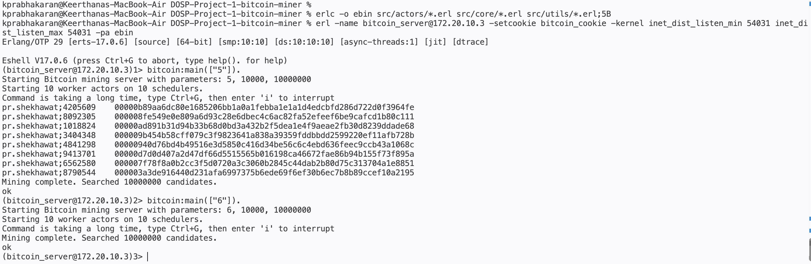

# COP5615 Project 1 - Bitcoin Miner

This project is implemented in Erlang and uses the Actor Model for parallel and distributed computation.

## Group members:
Pradhyuman Singh Shekhawat, UFID: 55742970, Email: [pr.shekhawat@ufl.edu](mailto\:pr.shekhawat@ufl.edu)

Keerthana Prabhakaran,  UFID: 20255736 , Email: [kprabhakaran@ufl.edu](mailto\:kprabhakaran@ufl.edu)

## Project Overview
The program searches for strings whose SHA-256 hash starts with a specified number of zeroes.
The mining work is divided into ranges and processed by worker actors under the control of a boss actor.
The implementation is designed to make use of multiple CPU cores and to support distributed workers running on other machines.

## Actor Model and Work Distribution
The mining work is divided among worker actors.
The boss actor maintains the work allocation and gives each worker a range of candidate values.
When a worker finishes, it sends the results back to the boss and receives another range when more work is available.
This allows multiple workers to operate concurrently while keeping work allocation centralized in the boss.

## Project Structure
```text
DOSP-Project-1-bitcoin-miner/
├── src/
│   ├── actors/
│   │   ├── bitcoin_boss.erl
│   │   └── bitcoin_worker.erl
│   ├── core/
│   │   ├── bitcoin.erl
│   │   └── bitcoin_miner.erl
│   └── utils/
│       └── bitcoin_utils.erl
├── test/
│   └── bitcoin_tests.erl
├── benchmark/
│   └── bitcoin_benchmark.erl
│   └── run_benchmark.sh
│   └── run_k4.sh
│   └── results/
│   │   ├── benchmark_results.csv
│   │   ├── k4_highest_zero.txt
│   │   ├── k4_output.txt
│   │   ├── k4_summary.txt
│   │   ├── k4_time.txt
├── images/
├── README.md
└── .gitignore
```

### Source Files
|Filename|Description|
|---|---|
|src/core/bitcoin.erl| Command-line entry point for the program.|
src/actors/bitcoin_boss.erl| Coordinates the mining process. It creates worker actors, assigns ranges of work receives completed results, and assigns additional work to available workers.
|src/actors/bitcoin_worker.erl|Worker actor responsible for receiving a range of candidate values, mining that range, and returning any valid coins to the boss.|
|src/core/bitcoin_miner.erl| Performs the actual mining operation over an assigned range.|
|src/utils/bitcoin_utils.erl| Contains candidate generation, SHA-256 hash conversion, and leading-zero helpers.|
|benchmark/run_benchmark.sh| Runs benchmarks across different work-unit sizes, measures execution and CPU times, calculates the CPU-to-real-time ratio, and saves the results to results/**benchmark_results.csv**
|benchmark/run_k4.sh| Runs the final k=4 mining benchmark, records real/user/system CPU times, calculates CPU time and CPU-to-real-time ratio, counts coins found, identifies the coin with the highest number of leading zeroes, and writes the results to **k4_summary.txt** and **k4_output.txt**

## Steps to Execute
Compile the source files and test:
```bash
mkdir -p ebin
erlc -o ebin src/actors/**.erl src/core/**.erl src/utils/*.erl
```
### For dsitributed computation:
Start server:
```bash
erl -name bitcoin_server@<server_ip> -setcookie bitcoin_cookie -kernel inet_dist_listen_min 54031 inet_dist_listen_max 54031 -pa ebin
```

Start worker:
```bash
erl -name bitcoin_worker@<worker_ip> -setcookie bitcoin_cookie -kernel inet_dist_listen_min 54031 inet_dist_listen_max 54031 -pa ebin
```

Start mining computation for K:
```erlang
bitcoin:main(["4"]).
```

Initiate worker with server ip:
```erlang
bitcoin:main(["<server_ip>"]).
```

Here mining starts on hashes with 4 leading 0’s  =>
`0000`

The server prints each valid coin as an independent line in the following
format, with the input string and SHA-256 hash separated by a TAB:

```text
kprabhakaran;425956 00007657795b1a50efa6fe8043ab5ecfe8eb210c926b31af986e783aacec17e0
```

## 
### Example 1
The project specification requires:
```text
pr.shekhawat;kjsdfk11
```
to produce:
```text
fe34d1b51a9a75dbdfbc9aa92a779516e8710a47c0cd9b5b25d7e23cda35b711
```

## Distrituted Execution
The implementation was successfully tested using two machines. The server
displayed the mined coins while the remote worker participated in the mining without displaying mining results.

|Parameter|Value|
|--|--|
|K |4 |
|WorkUnit |10,000| 
|TotalWork  |10,000,000 |

Server
 
Client


The execution times were measured separately on the client and server using
the `time` command.

| work_unit | real_seconds | user_seconds | sys_seconds | cpu_seconds | cpu_real_ratio |
| --------: | -----------: | -----------: | ----------: | ----------: | -------------: |
|     10000 |       24.726 |         6.33 |        0.31 |        6.64 |           0.27 |
|     10000 |       14.619 |        58.17 |        1.81 |       59.98 |           4.10 |


The server therefore shows significant parallel CPU utilization, while
the client has relatively little local CPU utilization. This proves distributed computation where most of the computational work is
performed by the server.

## Server Only Execution
The server is also designed to mine coins without remote workers. Local worker actors are created by the server and receive work from the boss actor.

## Validations
|Parameter|Result|Screenshot|
|---|----------------|--|
|Coin with most 0s kprabhakaran | 5 | |
|Coin with most 0s pr.shekhawat | 5  ||
| Largest number of working machines/laptops tested| 2| |


## Testing & Benchmark
Compile the source files and test and benchmark:
```bash
mkdir -p ebin
erlc -o ebin src/actors/**.erl src/core/**.erl src/utils/*.erl test/**.erl benchmark/**.erl
```

Run the unit tests:
```bash
erl -noshell -pa ebin -eval 'eunit:test(bitcoin_tests, [verbose]), halt().'
```

Benchmark for performance:
```bash
sh run_benchmark.sh
```

Benchmark implementation for k=4
```bash
sh run_k4.sh
```

## Performance

A work unit is the number of candidate sub-problems assigned to a worker in a
single request from the boss.

Different work-unit sizes were benchmarked using `k = 4` and a total search
space of ten million candidates.

The benchmark results were:
| Work unit | Real time | User time | System time | CPU time | CPU/REAL |
|---:|---:|---:|---:|---:|---:|
| 1,000 | 5.18 s | 45.56 s | 0.87 s | 46.430 s | 8.963 |
| 5,000 | 5.73 s | 46.56 s | 0.82 s | 47.380 s | 8.269 |
| 10,000 | 5.39 s | 47.38 s | 0.82 s | 48.200 s | 8.942 |
| 50,000 | 5.70 s | 48.75 s | 0.80 s | 49.550 s | 8.693 |
| 100,000 | 5.61 s | 48.54 s | 0.80 s | 49.340 s | 8.795 |

The benchmark showed that a work-unit size of `1,000` produced the lowest measured real time (5.18 seconds). The work-unit sizes were evaluated by running the same `k = 4` mining workload over ten million candidates and measuring real time, user CPU time, system CPU time, total CPU time, and the CPU/REAL ratio.

The difference between the best-performing configuration (`1,000`) and
`10,000` was small (5.18 seconds versus 5.39 seconds).


