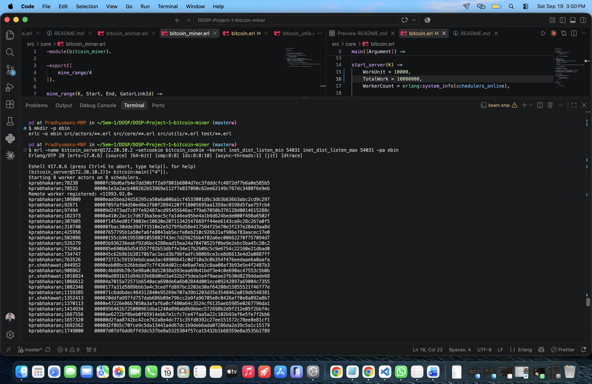
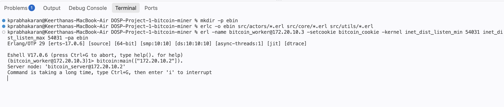
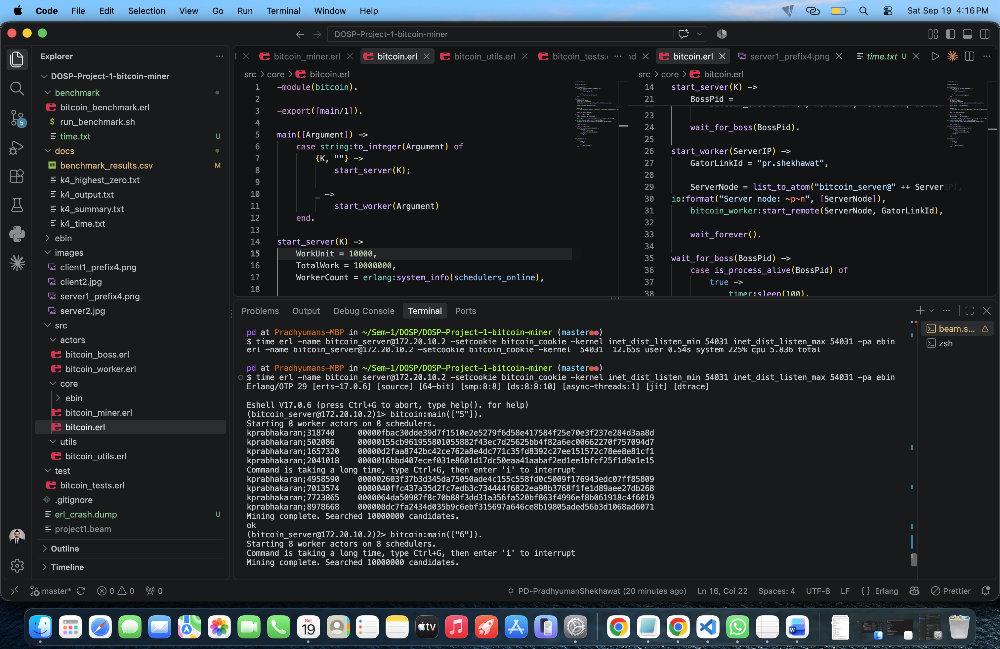

# COP5615 Project 1 - Bitcoin Miner

This project is implemented in Erlang and uses the Actor Model for parallel and distributed computation.

## Group members:
Pradhyuman Singh Shekhawat, UFID: 55742970, Email: [pr.shekhawat@ufl.edu](mailto\:pr.shekhawat@ufl.edu)

Keerthana Prabhakaran,  UFID: 20255736 , Email: [kprabhakaran@ufl.edu](mailto\:kprabhakaran@ufl.edu)

## Project Overview
The program searches for strings whose SHA-256 hash starts with a specified number of zeroes.
The mining work is divided into ranges and processed by worker actors under the control of a boss actor.
The implementation is designed to make use of multiple CPU cores and to support distributed workers running on other machines.

## Current Implementation
The project currently includes:
- SHA-256 hashing using Erlang's `crypto` module
- Verification of hashes with a required number of leading zeroes
- Candidate generation using a GatorLink ID and nonce
- Worker actors for processing ranges of candidate values
- A boss actor that assigns work to workers
- Dynamic assignment of new work when a worker finishes its current range
- Multiple worker actors running concurrently
- Use of the available Erlang schedulers for local parallel execution
- Command-line entry point for starting the miner

## Project Structure
```text
DOSP-Project-1-bitcoin-miner/
├── src/
│   ├── actors/
│   │   ├── bitcoin_boss.erl
│   │   └── bitcoin_worker.erl
│   ├── core/
│   │   ├── bitcoin.erl
│   │   └── bitcoin_miner.erl
│   └── utils/
│       └── bitcoin_utils.erl
├── test/
│   └── bitcoin_tests.erl
├── README.md
└── .gitignore
```

### Source Files
|Filename|Description|
|---|---|
|src/core/bitcoin.erl| Command-line entry point for the program.|
src/actors/bitcoin_boss.erl| Coordinates the mining process. It creates worker actors, assigns ranges of work receives completed results, and assigns additional work to available workers.
|src/actors/bitcoin_worker.erl|Worker actor responsible for receiving a range of candidate values, mining that range, and returning any valid coins to the boss.|
|src/core/bitcoin_miner.erl| Performs the actual mining operation over an assigned range.|
|src/utils/bitcoin_utils.erl| Contains candidate generation, SHA-256 hash conversion, and leading-zero helpers.|

## Steps to Execute
Compile the source files and test:
```bash
mkdir -p ebin
erlc -o ebin src/actors/**.erl src/core/**.erl src/utils/*.erl test/**.erl
```

Run the unit tests:
```bash
erl -noshell -pa ebin -eval 'eunit:test(bitcoin_tests, [verbose]), halt().'
```

Start Erlang with the compiled modules:
```bash
erl -name bitcoin_server@192.168.0.14 -setcookie bitcoin_cookie -kernel inet_dist_listen_min 54031 inet_dist_listen_max 54031 -pa ebin
```

The current local entry point accepts the required number of leading zeroes:
```erlang
bitcoin:main(["4"]).
```

For example, 4 searches for hashes beginning with:
```text
0000
```

The server prints each valid coin as an independent line in the following
format, with the input string and SHA-256 hash separated by a TAB:

```text
input;nonce<TAB>SHA-256-hash
```

## 
### Example 1
The project specification requires:
```text
pr.shekhawat;kjsdfk11
```
to produce:
```text
0d402337f95d018438aad6c7dd75ad6e9239d6060444a7a6b26299b261aa9a8b
```

## Actor Model
The mining work is divided among worker actors.
The boss actor maintains the work allocation and gives each worker a range of candidate values.
When a worker finishes, it sends the results back to the boss and receives another range when more work is available.
This allows multiple workers to operate concurrently while keeping work allocation centralized in the boss.

## Distributed Mining
A server will allow the remote worker running on another machine to connect and receive mining work.
The intended usage is:

**Server:**
```text
bitcoin <number_of_zeroes>
```

**Worker:**
```text
bitcoin <server_ip>
```


## Result
|Parameter|Result|Screenshot|
|---|----------------|--|
|4 coins|WorkUnit 10,000;TotalWork  10,000,000 | |
|Coin with most 0s kprabhakaran | 5 | |
|Coin with most 0s pr.shekhawat | 5  ||
| Largest number of working machines/laptops tested| 2| |


## Performance

A work unit is the number of candidate sub-problems assigned to a worker in a
single request from the boss.

Different work-unit sizes were benchmarked using `k = 4` and a total search
space of ten million candidates.

The benchmark results were:

| Work unit | Real time | User time | System time | CPU time | CPU/REAL |
|---:|---:|---:|---:|---:|---:|
| 1,000 | 10.80 s | 69.19 s | 0.18 s | 69.37 s | 6.423 |
| 5,000 | 10.49 s | 67.20 s | 0.17 s | 67.37 s | 6.422 |
| 10,000 | 10.28 s | 67.52 s | 0.19 s | 67.71 s | 6.587 |
| 50,000 | 10.05 s | 67.15 s | 0.20 s | 67.35 s | 6.701 |
| 100,000 | 10.62 s | 67.72 s | 0.21 s | 67.93 s | 6.396 |

The benchmark showed that a work-unit size of `50,000` produced the lowest
measured real time (10.05 seconds). The work-unit sizes were evaluated by
running the same `k = 4` mining workload over ten million candidates and
measuring real time, user CPU time, system CPU time, total CPU time, and the
CPU/REAL ratio.

The difference between the best-performing configuration (`50,000`) and
`10,000` was small (10.05 seconds versus 10.28 seconds). The final
implementation retains a work unit of `10,000` because this configuration was
successfully validated during the distributed execution.

The final implementation uses a work unit of:

```text
10,000 candidates
```

## Running Time and Parallelism

The execution times were measured separately on the client and server using
the `time` command.

#### Client

- **Real time:** 24.726 seconds
- **User CPU time:** 6.33 seconds
- **System CPU time:** 0.31 seconds
- **Total CPU time:** 6.64 seconds
- **CPU/Real ratio:** $6.64 / 24.726 \approx 0.27$

Thus, the client used approximately **0.27 effective CPU cores** during
the computation.

#### Server

- **Real time:** 14.619 seconds
- **User CPU time:** 58.17 seconds
- **System CPU time:** 1.81 seconds
- **Total CPU time:** 59.98 seconds
- **CPU/Real ratio:** $59.98 / 14.619 \approx 4.10$

Thus, the server used approximately **4.10 effective CPU cores** during
the computation.

The server therefore shows significant parallel CPU utilization, while
the client has relatively little local CPU utilization. This proves distributed computation where most of the computational work is
performed by the server.

### Distributed Execution

The implementation was successfully tested using two machines. The server
displayed the mined coins while the remote worker participated in the mining
without displaying mining results.

## Summary

The project implements a parallel and distributed Bitcoin-like miner using
Erlang actors. The boss actor manages the search space and dynamically assigns
ranges to worker actors. Workers independently perform SHA-256 mining and
return valid coins to the boss.

The final `k = 4` execution searched 10,000,000 candidates using 8 worker
actors and produced 135 valid coins. The measured CPU/REAL-time ratio was
6.113.

The final implementation uses a work unit of 10,000 candidates. Although
50,000 candidates produced the lowest measured real time during benchmarking,
10,000 was retained because it was successfully validated during distributed
execution.

The implementation was successfully tested across 2 machines.


